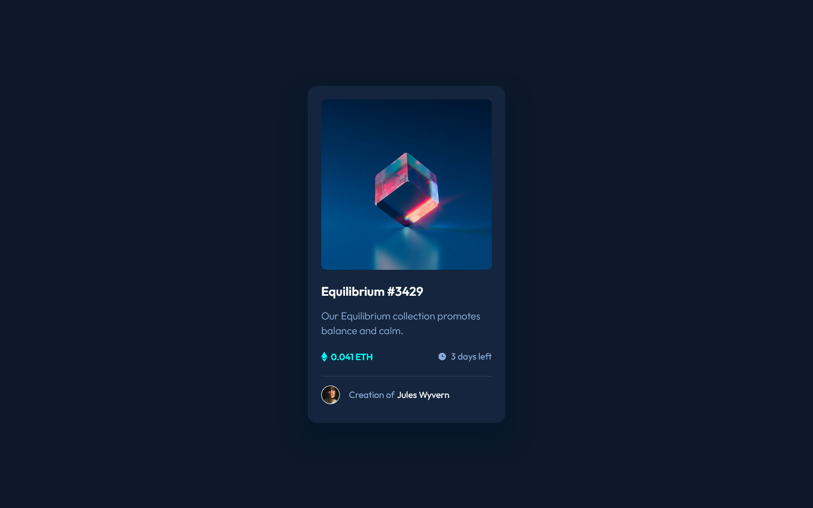

# Frontend Mentor - NFT preview card component solution

This is a solution to the [NFT preview card component challenge on Frontend Mentor](https://www.frontendmentor.io/challenges/nft-preview-card-component-SbdUL_w0U). Frontend Mentor challenges help you improve your coding skills by building realistic projects. 

### Screenshot

### Links

- Solution URL: [FrontEndMentor](https://www.frontendmentor.io/solutions/nft-IFprjEhgDg)
- Live Site URL: [Netlify](https://grand-shortbread-897579.netlify.app/)

### Built with

- HTML 5, CSS 3 (With Flexbox).

## Author

- Frontend Mentor - [@Alexioos95](https://www.frontendmentor.io/profile/Alexioos95)
- LinkedIn - [@AlexisPayen](https://www.linkedin.com/in/alexispayen/)
